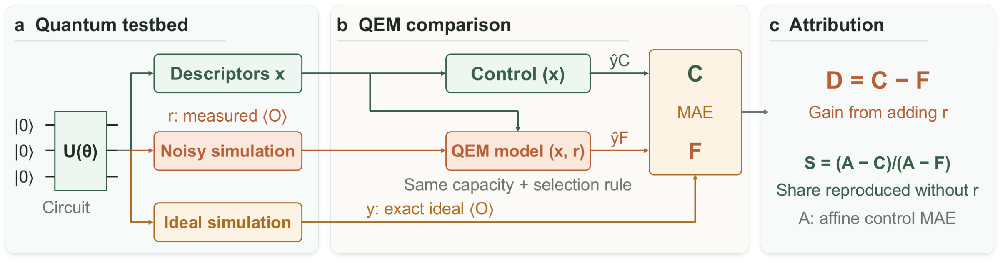
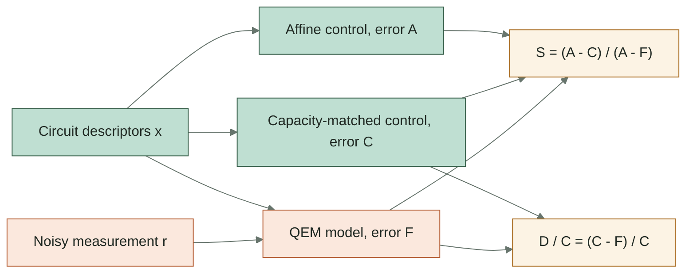

<a id="readme-top"></a>

<div align="center">



# QEMScore

**A controlled benchmark for how much the noisy measurement adds to learned quantum error mitigation.**

[](https://github.com/yzhao062/QEMScore/actions/workflows/ci.yml) [](LICENSE) [](pyproject.toml) [](https://github.com/yzhao062/QEMScore/releases/tag/campaign-archive-v1) [](#citation)

[Install and Run](#install-and-run) &nbsp;•&nbsp; [What This Looks Like](#what-this-looks-like) &nbsp;•&nbsp; [Campaign Archive](#campaign-archive) &nbsp;•&nbsp; [What the Campaign Found](#what-the-campaign-found) &nbsp;•&nbsp; [What Ships](#what-ships-in-v010) &nbsp;•&nbsp; [Citation](#citation)

</div>

> [!NOTE]
> QEMScore is maintained by Yue Zhao (University of Southern California), the author named in [`CITATION.cff`](CITATION.cff). It accompanies a paper under double-blind review; the preprint link will be added here when it is public.

How much does the noisy measurement add to a learned mitigator? An accuracy table cannot say, because a model handed the circuit description can score well without reading the measurement at all. QEMScore adds the comparison that can. Each simulated circuit carries an exact ideal answer. The controlled campaign scores each learned mitigator beside a control from the same model family, selected by the same rule, that reads the same circuit description but never the measurement. A ledger records each method's circuit-evaluation spend; nothing equalizes it.

## What You Get

- 🎯 **Measurement-free controls:** every run pairs `ridge` with `feat-only`, its twin that never reads the measurement; the campaign analysis in `qemscore.campaign` adds `liao-feat-only`, the capacity-matched twin of `liao`.
- 🧪 **Exact ideal labels:** every simulated circuit carries a statevector or Stim ground truth, logged apart from circuit-evaluation counts.
- 📒 **Circuit-evaluation ledgers:** each method records its training, mitigation-extra, and test-prediction spend, and split-v2 runs reject a configuration over its per-method-cell tier cap.
- 🔀 **Six settings:** in-distribution S0 plus five out-of-distribution axes, from noise family to shot count, generate and run today; S5 is declared but refuses generation.
- ⚙️ **Eight registered methods:** `raw`, `ridge`, `zne`, and `liao`, plus four controls and diagnostics, from one `qemscore run`.
- 🔁 **Frozen reproducibility recipe:** two presets reproduce identical item-row hashes on a locked dependency set, checked by CI on every push.
- 📦 **Campaign archive release:** the frozen campaign's report, rosters, and records ship as a checksummed release asset, with item streams regenerable from recorded seeds.

v0.1.0 is an alpha research artifact. S5 cannot generate a dataset yet, and CDR, vnCDR, budget equalization, and risk routing are absent. The installed package ships no paper-scale dataset; the campaign behind the paper ships separately as a release asset. Everything else that is missing is listed under [Not Implemented Yet](#not-implemented-yet).

## How It Works

Read the figure above from left to right. Its testbed panel simulates one circuit into descriptors x, a noisy simulation r, and an exact ideal simulation y. The comparison panel trains a control on x alone and a QEM model on x and r, with the same capacity and selection rule. Both are scored against y by mean absolute error, giving C and F. The attribution panel forms D = C - F, the gain from adding r. A is the error of a plain affine control. The panel also forms S = (A - C)/(A - F), the share of the mitigator's improvement over A that the control reproduces without reading r. The paper reports S beside D/C, the share of the control's remaining error that adding r removes. In the campaign, A, C, and F are the errors of `feat-only`, `liao-feat-only`, and `liao`, so the `feat-only` row of the capture below is A.

## What This Looks Like

### Running `qemscore run`

```text
$ qemscore run --data data/t0-micro --out results/t0-micro
artifact 21636a6f66d5  dataset b9ed7863d6a1  preset t0-micro  test items 12
method     role                      MAE            RMSE            Bias ExcessLoss(sum)             OCR        PhysViol
raw        baseline             0.130675        0.135649       -0.130675        0.000000        0.000000        0.000000
ridge      learned              0.057990        0.071580        0.039838        0.226576        0.250000        0.333333
zne        qem-baseline         0.064756        0.077611       -0.051248        0.080361        0.166667        0.083333
liao       competitor           0.058853        0.070033       -0.004634        0.229832        0.333333        0.000000
feat-only  control              0.057639        0.070961        0.039369        0.213040        0.250000        0.333333
noisy-only control              0.062425        0.075080        0.018049        0.210467        0.333333        0.083333
shrinkage  control              0.130837        0.156591        0.014738        0.635752        0.500000        0.000000
shuf-noisy diagnostic           0.055780        0.069589        0.040703        0.197530        0.250000        0.166667

method          B_train     B_extra      B_pred     nominal    realized      ratio    eval/EV
raw                   0           0        3072        3072        3072       1.00      256.0
ridge              5120           0        3072        8192        8192       1.00      256.0
zne                   0        6144        3072        3072        9216       3.00      768.0
liao               5120           0        3072        8192        8192       1.00      256.0
feat-only             0           0           0           0           0  undefined        0.0
noisy-only         5120           0        3072        8192        8192       1.00      256.0
shrinkage             0           0           0           0           0  undefined        0.0
shuf-noisy         5120           0        3072        8192        8192       1.00      256.0

exact labels (statevector=32, stim=0; logged separately)
surrogate alarm: TRIGGERED (ridge MAE 0.057990 vs feature-only 0.057639)
```

One `run` on the `t0-micro` preset prints an error table and a circuit-evaluation table for all eight registered methods. The alarm on the last line fires whenever `feat_mae <= 1.05 * ridge_mae`, so a `feat-only` control that matches or beats `ridge`, as it does here, trips it. That is the benchmark's question asked of every run.

### Files Written by `generate` and `run`

```text
data/t0-micro/
├── items.jsonl        16,613 bytes
└── manifest.json       5,871 bytes

results/t0-micro/
└── results.json      212,441 bytes
```

`generate` writes a canonical item stream plus a manifest that records package versions, seed derivation, severity grids, the feature specification, and the dataset hash. `run` writes one results file with every method's predictions, metrics, and ledger.

### Three Error Levels and Two Ratios



Every error is a mean absolute error against the exact ideal label y. S is the share of the full model's improvement over A that is reproduced without the measurement; D/C is the share of the control's error that the measurement removes.

## Install and Run

QEMScore is not on PyPI and no release wheel exists. Install it from source into a virtual environment with Python 3.10 or later:

```powershell
python -m pip install git+https://github.com/yzhao062/QEMScore.git
```

> [!TIP]
> Windows Miniforge builds need `$env:MKL_THREADING_LAYER = "SEQUENTIAL"` set before the commands below run; it avoids a complex Schur decomposition crash. `$env:PYTHONDONTWRITEBYTECODE = "1"` skips bytecode caching. A POSIX shell sets the same two variables with `export NAME=value`.

A clone followed by `python -m pip install .` from its root works as well. Either install resolves the declared compatibility ranges and carries no frozen-hash guarantee; the [Reproducibility Recipe](#reproducibility-recipe) below installs the exact lock. Then, from any writable directory:

```powershell
qemscore generate --preset t0-micro --out data/t0-micro
qemscore run --data data/t0-micro --out results/t0-micro
```

The first command generates 32 observable items and prints their dataset hash; compare it to the frozen value only under the locked recipe. The second prints the tables shown above. This legacy-v1 preset has train and test roles and does not establish out-of-distribution reliability, so treat its numbers as a smoke-test result. The built-in split-v2 S0 preset adds a source-validation role:

```powershell
qemscore generate --preset s0-t0-micro --out data/s0-t0-micro
qemscore run --data data/s0-t0-micro --tier L --out results/s0-t0-micro
python -c "from qemscore.validation import validate_split_artifact; items, manifest = validate_split_artifact('data/s0-t0-micro'); print(len(items), 'validated items')"
```

Use a new output directory for each split-v2 generation. The console script has exactly two subcommands, `generate` and `run`; `qemscore --help` lists them. Validation is a Python API: `validate_split_artifact` for split-v2 datasets and `qemscore.runner.run.validate_run_artifact` for result dictionaries. There is no `validate` subcommand and no config-file CLI. Custom out-of-distribution datasets use the Python `SplitSpec` and `generate_split` APIs; `s0-t0-micro` is the only built-in split-v2 preset.

## Campaign Archive

QEMScore has five GitHub releases. Tag `campaign-archive-v1` (2026-09-08) ships the frozen controlled campaign reported in the paper as a release asset rather than as package data. Tag `descriptor-information-v1` (2026-10-04, at `431d101`) ships the fits of the descriptor-information experiment and its three follow-ups; see [Descriptor-Information Fits](#descriptor-information-fits) below. Tag `confirmation-v1` (2026-10-06, at `0152dd5`) ships the new-seed confirmation, the crossed follow-ups, and the ML-QEM refits; see [Confirmation Fits](#confirmation-fits) below. Tags `exact-labels-oracle-v1` and `shift-transfer-v1` ship the fits and logs of the two rules of 2026-10-06; see [Exact-Label and Shift-Transfer Fits](#exact-label-and-shift-transfer-fits) below.

```bash
curl -L -O https://github.com/yzhao062/QEMScore/releases/download/campaign-archive-v1/campaign-archive-v1.tar.gz
sha256sum campaign-archive-v1.tar.gz
tar -xzf campaign-archive-v1.tar.gz
cd campaign-archive-v1 && sha256sum -c SHA256SUMS.txt
```

| Field | Value |
|---|---|
| Asset | `campaign-archive-v1.tar.gz`, 62,575,902 bytes |
| SHA-256 | `62f1ef1875eaf54100c78fe26164b31d62b5efecfb4740e22a4e2a3c313bf918` |
| Extracts to | `campaign-archive-v1/`: 67 checksummed payload files, 277,466,583 bytes, plus `SHA256SUMS.txt` and `MANIFEST.md`; all 67 checksum lines report `OK` |
| Tree fingerprint | `c3b79a0766c1d48117995826a2ee48a1f0b2a1955931f314a9d298dbc9611821`, the SHA-256 of `SHA256SUMS.txt` itself |

The archive holds the campaign report, tables, audit, and frozen manifest, plus per-setting rosters with every method's test predictions, per-cell metrics, and circuit-evaluation ledger. Per-setting records with role assignments, selected configurations, and untouched-test predictions are included, as are the fit bindings and each setting's dataset manifest. The generated item streams and their sidecars, 771 MB, are excluded, because the deterministic generators in this repository reproduce them from the recorded seed and dependency lock. `report.json` carries the twelve dataset hashes a regeneration must match. [`campaign-archive/MANIFEST.md`](campaign-archive/MANIFEST.md) lists every component, and [`campaign-archive/SHA256SUMS.txt`](campaign-archive/SHA256SUMS.txt) is a copy of the checksum file that travels in git.

### Descriptor-Information Fits

Release `descriptor-information-v1` contains fit records for the original descriptor-information experiment and its three follow-ups, in four assets. The original rule was frozen before new-rung and new-dataset fits; it reused earlier R0 fits. Each follow-up rule was committed before its new fits; see [`docs/frozen-rules/`](docs/frozen-rules/). Reproducing `posthoc-strongest-reference.json` requires additional fitting from the prepared Part A data. [`artifacts/descriptor-information/README.md`](artifacts/descriptor-information/README.md) gives the commands and required inputs. `artifacts/descriptor-information/posthoc-stacking-pins.json` records each asset's SHA-256 and those of the fit files the post hoc stacking reads.

| Asset | Bytes | SHA-256 | Holds |
|---|---:|---|---|
| `descriptor-information-v1.tar.xz` | 89,990,540 | `9cf19a499122cdff92560333cb2a91b2fcdd098ad8fe0cb95e166f7d186dfa57` | Original experiment: every fit with per-candidate predictions, and the slim cached test items |
| `descriptor-information-strength-v1.tar.xz` | 99,746,872 | `d9bc11b4eed70d90f7b3c605c1b1eb3c9656d15fbc83b2c20fe7511a7bdae170` | Strength-indicator rerun: fits only (reads the first asset's caches) |
| `descriptor-information-strong-learners-v1.tar.xz` | 236,818,824 | `80fcccc657fafcfe68d55a899cf5008977c2e6e7e0994cffadb4e71a32d04643` | Strong-learner rerun: Part A and Part B fits, derived baseline fits, run log |
| `descriptor-information-shot-sweep-v1.tar.xz` | 409,030,636 | `d39969f21e77e4ab33a1daaa7b8daedf4b93cb9753c569d575af0ec631971b16` | Shot-count sweep: seven level datasets, each level's fits and caches, check reports, run log |

```bash
curl -L -O https://github.com/yzhao062/QEMScore/releases/download/descriptor-information-v1/descriptor-information-v1.tar.xz
sha256sum descriptor-information-v1.tar.xz
tar -xJf descriptor-information-v1.tar.xz
```

### Confirmation Fits

Release `confirmation-v1` holds the datasets and fits of three rules committed at `b04f49b` before any dataset or fit they govern: [`2026-10-04-fresh-confirmation.md`](docs/frozen-rules/2026-10-04-fresh-confirmation.md), [`2026-10-04-crossed-follow-ups.md`](docs/frozen-rules/2026-10-04-crossed-follow-ups.md), and [`2026-10-04-mlqem-own-data.md`](docs/frozen-rules/2026-10-04-mlqem-own-data.md). The analyses, scores, and logs are in [`artifacts/descriptor-information/round8/`](artifacts/descriptor-information/round8/) and [`artifacts/mlqem-own-data/`](artifacts/mlqem-own-data/). Part G's 640-circuit reference fits are included as files, copied from release `descriptor-information-v1`. The ML-QEM data are not redistributed; `qiskit-community/ml-qem` at commit `b1eccf8` and [`reanalysis/mlqem/upstream_data_sha256.json`](reanalysis/mlqem/upstream_data_sha256.json) identify them.

| Asset | Bytes | SHA-256 | Holds |
|---|---:|---|---|
| `descriptor-information-fresh-v1.tar.xz` | 1,309,808,828 | `1bfcdb1c46938013cbb9d743f61c2e441aceb17dbcced5e9d0f6fb9dcb115e15` | New seeds 401, 503, 607: level datasets, caches and cache records, fits of both candidate sets, the predictions file, generation reports with the tree hash list, run log |
| `descriptor-information-crossed-follow-ups-v1.tar.xz` | 726,032,300 | `e341be45e244f90fa14ae524281f577479e2a6aaaef135894c12cbcb32e615c2` | Parts B, C, D, and G: fits with per-candidate predictions, analyses, run log |
| `mlqem-own-data-v1.tar.gz` | 43,676,096 | `fc6303e3186523d889b81754a0a09f929d2b91e36496830ec9c328c172a343fc` | ML-QEM refits: 438 fits and the encoded feature matrices |

### Exact-Label and Shift-Transfer Fits

Release `exact-labels-oracle-v1` holds the fits and logs of [`2026-10-06-round9-follow-ups.md`](docs/frozen-rules/2026-10-06-round9-follow-ups.md); its labels, oracle, pooling, and field outputs are in the repository ([`artifacts/mlqem-exact/`](artifacts/mlqem-exact/), [`artifacts/mlqem-own-data/round9/`](artifacts/mlqem-own-data/round9/), [`artifacts/descriptor-information/round9/`](artifacts/descriptor-information/round9/)). Release `shift-transfer-v1` holds the fits and logs of [`2026-10-06-shift-transfer.md`](docs/frozen-rules/2026-10-06-shift-transfer.md), which scores the descriptor ladder's fitted models on deeper circuits (S4) and stronger noise (S2); its records are in [`artifacts/descriptor-information/shift-transfer/`](artifacts/descriptor-information/shift-transfer/).

| Asset | Bytes | SHA-256 | Holds |
|---|---:|---|---|
| `mlqem-exact-fits-v1.tar.xz` | 32,616,140 | `43e6e78abfa21843530a8ab204c8dbcd39ba14ea49e815ccb4be14de4c2d913d` | ML-QEM refits with exact circuit parameters and on exact labels |
| `round9-run-logs-v1.tar.xz` | 4,536 | `43d8442145f7129af0939596ec32d597c654a7827e6ef7ff7951040f0f6fe179` | Run logs of the 2026-10-06 follow-ups |
| `shift-transfer-fits-v1.tar.xz` | 34,755,064 | `29f2a383aaee17c6f0c624adaadf374cb217d9df314192b5f144614fe7be163c` | 960 shift-transfer fits, N3 tables, R4 encoder caches, generation and run logs |

## What the Campaign Found

A paper describing QEMScore is under review, and the preprint link will be added when it is public. It reports three findings, paraphrased below from the submitted abstract, and one recommendation: a learned mitigator's accuracy should be reported beside such controls.

**Under familiar conditions, the control matches most of the mitigator's gain.** In the in-distribution setting S0, evaluated across two spin-chain families and three seeds, continuous couplings identify the target. The control that never reads the measurement matches 87.7 to 100.5 percent of the mitigator's gain over an affine fit to the circuit description. A plain polynomial in the coupling parameters, fitted after the campaign, beats the mitigator on all six evaluations, reflecting the selected learners' capacity.

**Matching most of the gain is not matching the accuracy.** For these selected learners, the mitigator still removes 19.5 to 74.5 percent of the error the capacity-matched control leaves on five of six evaluations. The paper reads this as a learner-specific gap rather than a measurement requirement.

**On released hardware data, analyzed separately from this simulated campaign, the findings differ.** Where descriptors only partially identify queries, flexible models of the descriptors show negligible mean gain over affine fits in Q-LEAR. Measurement inputs carry predictive gains in both Q-LEAR and QRAFT. These comparisons reflect representation- and protocol-specific behavior rather than an isolated cross-regime difference.

## What Ships in v0.1.0

| Surface | Shipped Behavior |
|---|---|
| Circuits | TFI, QAOA-MaxCut, Heisenberg, random Clifford, and near-Clifford families |
| Noise | Six named families, each on a monotone L1 to L4 placeholder severity grid |
| Labels | Exact statevector labels and Stim labels, logged separately from circuit evaluations |
| Methods | `raw`, `ridge`, `zne` (local digital ZNE), and `liao` (restricted-feature ablation) |
| Controls and diagnostics | `feat-only`, `noisy-only`, `shrinkage`, and `shuf-noisy`, with a surrogate-control alarm |
| Splits | S0 plus S1, S2, S3, S4, S6 generation, validation, and runner support; S5 has grammar and validation definitions but refuses generation |
| Accounting | Training, mitigation-extra, and test-prediction ledgers; split-v2 preflight uses per-method-cell combined caps L 2,500,000, M 25,000,000, and H 250,000,000 |
| Analysis | Per-cell metrics, statistical summaries, inference utilities, the `evaluate_incremental_value` gate, and a report layer |
| Calibration | A [severity-calibration proposal](qemscore/noise/data/severity-calibration.proposal.json) that does not alter the shipped placeholder grids |
| Outputs | Canonical item streams, manifests, method and harm metrics, per-method ledgers, and report artifacts |
| Protocol | [`PROTOCOL-TRACE.md`](PROTOCOL-TRACE.md) maps every frozen protocol rule to its implementation and guarding test |

| Split | Axis | Release Status |
|---|---|---|
| S0 | Circuit instance, in-distribution | Generates and runs; built-in `s0-t0-micro` preset |
| S1 | Noise family | Generates and runs through the Python split API |
| S2 | Noise strength | Generates and runs through the Python split API |
| S3 | Circuit family | Generates and runs through the Python split API |
| S4 | Family-native depth | Generates and runs through the Python split API |
| S5 | Observable class | Refuses generation when validation or test observables are absent from training |
| S6 | Shot count | Generates and runs through the Python split API |

Out-of-distribution training and validation stay in the source domain; testing uses the target domain. Random Clifford data are labeled as the Clifford-control stratum, and `generate_report` keeps them out of the continuous-regression headline, rendering them as their own stratum section.

The local digital ZNE path uses deterministic global unitary folding at scale factors 1, 3, and 5, cross-checked against Mitiq by the test suite. The `liao` arm omits the published native-gate count vector, angle bins, and sparse Pauli-observable encoding; it is a restricted-feature ablation, not a reproduction of the published method. Legacy-v1 uses its random-forest arm, and split-v2 selects between random-forest and MLP arms on source validation data. The MLP epoch count, stopping rule, dropout, and weight decay are package declarations, not verified published settings.

The Python API `qemscore.stats.evaluate_incremental_value` compares a full model with the `feat-only` and `noisy-only` controls on source validation, using circuit-blocked paired intervals. It returns a dictionary whose `status` is `passed`, `failed`, or `not_evaluable`; compare that field explicitly, because the dictionary is always truthy. The runner does not invoke this gate; `tools/measure_incremental_value.py` drives it end to end.

<a id="reproducibility-recipe"></a>

<details>
<summary><b>Reproducibility Recipe</b></summary>

The frozen dataset hashes are SHA-256 digests of canonical JSON item rows sorted by `item_id`:

| Preset | Frozen Dataset Hash |
|---|---|
| `t0-micro` | `b9ed7863d6a1ce0d718907262d842e90e59c6eb7479a350837655bf542166bb7` |
| `t0-smoke` | `edf5837e0da10f1dc93151d5b29d1855f66ad76341ff6c28019096308f8fcdf3` |

These hashes guarantee exact item-row identity only for the named preset, its default configuration, CPython 3.12.13 on Windows AMD64, `PYTHONHASHSEED=0`, and `requirements/ci-py312.lock` with canonical-LF SHA-256 `20ce2461bc2e6f70e14eeb0feaf3fe7e3cb9e9af75031da04671eab99c2bfd70`. They cover sampled noisy values, exact labels, seeds, circuit metadata, and split assignments serialized in the rows. They do not guarantee identical result files, method performance, wall-clock time, or cross-platform item streams. Git pins the lock to LF on checkout, and the verifier also normalizes CRLF checkouts before computing this digest.

Use a source checkout or unpacked source distribution for this recipe: `requirements/` and `tools/` are not wheel contents. The recorded lock targets CPython 3.12.13 on Windows AMD64; the current CI workflow uses CPython 3.12.10. Local release checks also reproduce both streams on Miniforge CPython 3.12.12. These are distinct environments, not a cross-version guarantee.

In a fresh environment, from the source root, install the lock, then regenerate and check both streams. On Windows, keep the checkout and output paths short to accommodate split-v2 sidecars.

```powershell
$env:MKL_THREADING_LAYER = "SEQUENTIAL"
$env:PYTHONDONTWRITEBYTECODE = "1"
$env:PYTHONHASHSEED = "0"
$env:QEM_BENCH_CI_LOCK_SHA256 = python tools/verify_ci_lock.py --digest-only
if ($LASTEXITCODE -ne 0) { throw "CI lock verification failed" }
python -m pip install --only-binary=:all: -r requirements/ci-py312.lock
python -m pip install --no-deps .
python -m pip check
qemscore generate --preset t0-micro --out data/frozen/t0-micro
qemscore generate --preset t0-smoke --out data/frozen/t0-smoke
python tools/assert_frozen_hashes.py --root data/frozen
```

Every dataset manifest records package versions, seed derivation, the active severity grids, the feature specification, and the dataset hash. A frozen-artifact claim must also record the expected and observed lock digests and whether they match. Circuit cost is reported as backend calls times shots in three buckets. Exact-simulation label calls are recorded separately and never counted as circuit evaluations.

A wheel built locally with `python -m build` includes the preset generators and noise JSON resources, so it can generate the tiny datasets. It does not bundle the pre-generated CI datasets, the test suite, or paper-scale data. The source distribution includes the tests, lock, verification tools, and example report.
</details>

<a id="not-implemented-yet"></a>

<details>
<summary><b>Not Implemented Yet</b></summary>

CDR and vnCDR have no runner methods; the CDR cost formula and viability probe do not implement them. Lasso, HistGradientBoosting, and ensemble-combination runner methods are absent as well. The random forest inside `liao` is one ablation arm. There is no reject-and-fallback or risk-routing layer, and it is outside the scope of the first preprint.

The runner checks declared tier feasibility. It does not equalize realized method costs, spend unused allowance on extra shots, or schedule a matched-budget roster. Same-tier results can have different realized costs. S5 remains unavailable for dataset generation despite its grammar and validator definitions. A four-command, config-first CLI is not implemented.

The package ships no paper-scale dataset; the campaign's outputs are the [release asset above](#campaign-archive), and its item streams regenerate from the recorded seeds. L1 to L4 severity values remain placeholders; the calibration proposal is not applied, so equal severity labels do not establish matched noise severity across families. The package uses no quantum hardware and makes no quantum-advantage claim.

Prospective protocol decisions maintained outside this repository do not define shipped behavior. For v0.1.0, the source code, generated manifests, `PROTOCOL-TRACE.md`, and tests govern the executable contract that a public reader can inspect.
</details>

<a id="extension-interface"></a>

<details>
<summary><b>Extension Interface</b></summary>

v0.1.0 exposes built-in methods through the CLI and Python modules. Python callers can add phased methods with `MethodRegistration`, `register_method`, and `unregister_method`. The factory returns a fresh object with three ordered methods, `fit`, `select`, and `predict`, and the runner alone assigns role lists to these phases. `predict` returns a `MethodOutput` carrying the predictions and the method's own ledger. This programmatic interface is tested, but it is not declared stable across v0.x releases.

```python
from qemscore.budget import Method
from qemscore.datasets.generate import group_shots
from qemscore.runner.run import MethodOutput, MethodRegistration, register_method, unregister_method


class PassThrough:
    def fit(self, items, *, manifest, split_v2):
        return self

    def select(self, items):
        return self

    def predict(self, items, *, manifest):
        predictions = [item["noisy_expectation"] for item in items]
        return MethodOutput(predictions, 0, 0, group_shots(items), {"implementation": "pass-through"})


register_method(MethodRegistration("pass-through", "competitor", PassThrough, Method.RAW))
try:
    ...  # qemscore.runner.run.run(data_dir, out_dir, budget_tier="L") now includes the new method; legacy-v1 data takes no tier
finally:
    unregister_method("pass-through")
```
</details>

<a id="report-rendering"></a>

<details>
<summary><b>Report Rendering</b></summary>

Reports use a separate module entry point and require the `report` extra, installed from a source root:

```powershell
python -m pip install ".[report]"
python -c "import json; from pathlib import Path; Path('results/report-manifest.json').write_text(json.dumps({'schema_version': 'qem-bench-report-manifest-v1', 'runs': [{'results': 't0-micro/results.json'}]}), encoding='utf-8')"
python -m qemscore.reports --manifest results/report-manifest.json --out results/report
```

A report manifest is distinct from a dataset manifest; its result paths are relative to its own directory. The default report covers `raw`, `ridge`, and `zne` and writes `table1.tex`, `figure1.pdf`, and `report-trace.json`. Keep legacy-v1 and split-v2 runs in separate report manifests. A rendered example lives in [`examples/report-walking-skeleton/`](examples/report-walking-skeleton/).
</details>

## Citation

Use GitHub's **Cite this repository** control or the software metadata in [`CITATION.cff`](CITATION.cff). The software citation names Yue Zhao, University of Southern California, and version 0.1.0. There is no verified paper citation yet; the citation file carries a commented, single-line `preferred-citation` template to fill with the public preprint metadata when it becomes available.

## Contributing

See [`CONTRIBUTING.md`](CONTRIBUTING.md) for the locked setup, test commands, frozen-hash change rule, and CI gate. Participation is governed by [`CODE_OF_CONDUCT.md`](CODE_OF_CONDUCT.md).

## License

`QEMScore` is distributed under the [BSD 2-Clause License](LICENSE).

<div align="center">

<a href="#readme-top">↑ back to top</a>

</div>
